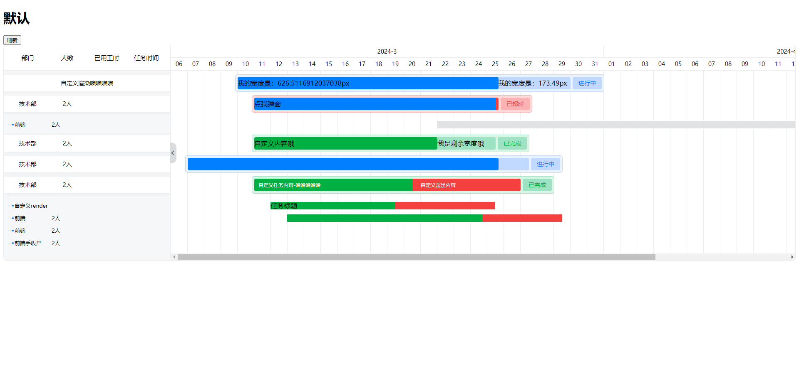

# vue3-gantt-component

基于 vue3 的甘特图

## 相关参数去这里查看

跟 react 版本参数一样 除去 render 不可用 <br>
[https://github.com/zrx-888/react-gantt](https://github.com/zrx-888/react-gantt)

## Install

```bash
npm i vue3-gantt-component
或者
 yarn add vue3-gantt-component
```

## Demo 需要翻墙

[https://react-gantt.vercel.app/](https://react-gantt.vercel.app/)



## 自定义进度条的内容与 React 版本 不太一样这里使用 slot

```js

import type {
  GanttDataProps,
  GanttHeadProps,
  GanttRefProps,
} from "vue3-gantt-component";
import Gantt from "vue3-gantt-component";


  <Gantt :head="head" :data="list" ref="ganttRef">
  /**
   *
   * @param width 进度条宽度（不包含超出的宽度）
   * @param activeWidth 选中进度条宽度
   * @param surplusWidth 剩余进度条宽度
   * @param overflowWidth 超出的宽度
   * @returns 自定义进度条的宽度
   */
    <template #parentSlot="{ activeWidth, overflowWidth }">
      <div style="display: flex">
        <div :style="{ width: activeWidth + 'px' }">
          我的宽度是：{{ activeWidth }}px
        </div>
        <div :style="{ width: overflowWidth + 'px' }" v-if="overflowWidth">
          我的宽度是：{{ overflowWidth && overflowWidth.toFixed(2) }}px
        </div>
      </div>
    </template>

    <template #childrenSlot="row">
      <div style="display: flex">
        <div :style="{ width: row.width + 'px' }">{{ row.width.toFixed(0) }}px</div>
      </div>
    </template>
  </Gantt>
```
